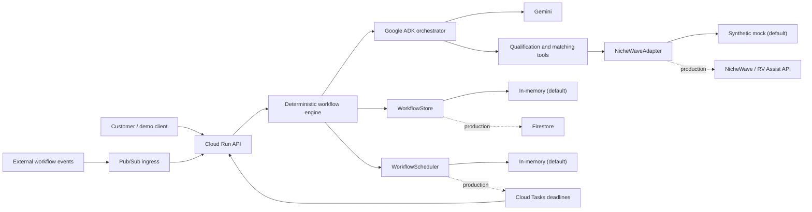

# RV Assist Autopilot

An asynchronous AI operator for the **All Things Agentic Hackathon — Taskmaster track**. It qualifies RV repair requests, finds and ranks technicians, and advances outreach workflows with explicit safety gates.

> [!IMPORTANT]
> **Hackathon eligibility and project boundary:** NicheWave and its RV Assist marketplace existed before the All Things Agentic Hackathon. This repository contains only the new RV Assist Autopilot work created during the submission period beginning **2026-08-17**. NicheWave/RV Assist is an external platform dependency accessed only through the `NicheWaveAdapter` contract. No pre-existing NicheWave source code is copied into this repository.

## What this scaffold proves

- Google ADK defines the Gemini-powered orchestrator and its typed tools.
- A deterministic workflow engine owns consequential state transitions and prevents unconfirmed bookings.
- Firestore, Pub/Sub, and Cloud Tasks have production adapters; in-memory implementations make local runs credential-free.
- A synthetic NicheWave adapter lets judges run the workflow without private platform access.
- Cloud Run packaging and Terraform establish the deployment path without hiding infrastructure decisions.

The initial slice intentionally stops short of live outreach and production booking logic. It establishes the architecture, contracts, state model, runnable mock path, and evaluation seams first.

## Architecture



Start with the [documentation hub](docs/README.md). Technical architecture is in [docs/technical/architecture.md](docs/technical/architecture.md), with editable [Mermaid source](docs/technical/architecture.mmd). Plain-language product and workflow guides are under [docs/user](docs/user/).

## Quick start

Prerequisite: a current Node.js LTS release (22.13+ or 24+). Node 23 is not supported by the lint toolchain.

```bash
cp .env.example .env
npm ci
npm run check
npm run demo
npm run demo:taskmaster
```

The demo submits the synthetic urgent Phoenix AC scenario and prints the resulting workflow state and ranked candidates. It uses no cloud credentials and makes no external calls.

`demo:taskmaster` runs the complete judging story: the first technician declines, Autopilot replans to the next candidate, that technician accepts, the customer confirms, and only then is a synthetic external job created.

Run the HTTP service:

```bash
npm run dev
curl -s http://localhost:8080/health
curl -s -X POST http://localhost:8080/v1/requests \
  -H 'content-type: application/json' \
  --data @samples/urgent-ac-request.json
```

### Apple container

On Apple silicon Macs using Apple's `container` CLI instead of Docker Desktop:

```bash
container build --tag rv-assist-autopilot:local .
container run --rm --detach --name rv-assist-autopilot rv-assist-autopilot:local
container list
```

Use the container IP shown by `container list`:

```bash
curl http://CONTAINER_IP:8080/health
container stop rv-assist-autopilot
```

The same OCI image remains deployable to Cloud Run.

## Gemini / ADK development

The exported ADK root agent lives at `src/agents/agent.ts`. Configure one supported authentication path in `.env`, then run:

```bash
npm run adk:run
# or
npm run adk:web
```

To use Gemini structured qualification in the HTTP workflow, set `QUALIFIER_MODE=gemini` and configure either `GOOGLE_API_KEY` or the Vertex AI variables. Model output is schema-validated and recorded with model/latency provenance. Timeouts, invalid JSON, and API errors fall back to the deterministic qualifier; deterministic hazard flags are always retained.

The normal mock demo is deterministic by design. Gemini is used for language understanding and planning through ADK; code remains authoritative for eligibility filters, state transitions, idempotency, and booking safety.

## Commands

| Command                   | Purpose                                                 |
| ------------------------- | ------------------------------------------------------- |
| `npm run dev`             | Start the API with file watching                        |
| `npm run demo`            | Run the credential-free synthetic scenario              |
| `npm run demo:taskmaster` | Run the complete decline/replan/accept/confirm timeline |
| `npm test`                | Run unit and integration tests once                     |
| `npm run test:watch`      | Run tests in watch mode                                 |
| `npm run eval`            | Run the 10-scenario metric and recovery evaluation      |
| `npm run lint`            | Run ESLint                                              |
| `npm run typecheck`       | Type-check without emitting                             |
| `npm run build`           | Compile production JavaScript into `dist/`              |
| `npm run check`           | Lint, type-check, test, and build                       |

## Configuration modes

Local defaults are `STATE_STORE=memory`, `EVENT_BUS=memory`, `WORKFLOW_SCHEDULER=memory`, and `NICHEWAVE_ADAPTER=mock`. Production modes require Google Application Default Credentials and their corresponding resources. The real NicheWave HTTP adapter is deliberately not implemented until its API contract and authentication scheme are agreed; selecting `NICHEWAVE_ADAPTER=http` fails fast.

Workflow callbacks are available at:

- `POST /v1/workflows/:id/technician-responses`
- `POST /v1/workflows/:id/customer-confirmation`
- `GET /v1/workflows/:id/timeline`
- `POST /v1/events/pubsub` for authenticated Pub/Sub push delivery
- `POST /v1/events/tasks` for authenticated Cloud Tasks deadline delivery

Cloud Tasks dispatches timeout messages at their explicit `dueAt`; Pub/Sub does not emulate a timer through repeated retries. Stale timeout deliveries are acknowledged and recorded without changing the completed or advanced workflow. Every callback has an idempotency key, and the external job contract also carries that key.

## Repository map

```text
src/
  agents/          Google ADK agent definition and tool wiring
  tools/           Small typed capabilities exposed to the agent
  workflows/       Durable state model and deterministic transitions
  adapters/        NicheWave, state-store, event-ingress, and scheduler boundaries
  domain/          Shared schemas and domain types
  api/             Cloud Run HTTP handlers
infrastructure/    Terraform and deployment notes
tests/             Unit and integration tests
evals/             Scenario-based evaluation harness
samples/           Synthetic judge-ready inputs and demo
docs/              Technical, operational, and non-developer documentation
```

## Safety boundary

Autopilot may classify, search, rank, and recommend autonomously. It must not claim a booking or create a confirmed job without a real technician acceptance. Ambiguous, hazardous, exhausted, or low-confidence cases move to `HUMAN_ESCALATION`.

## License

Apache-2.0. See [LICENSE](LICENSE).
