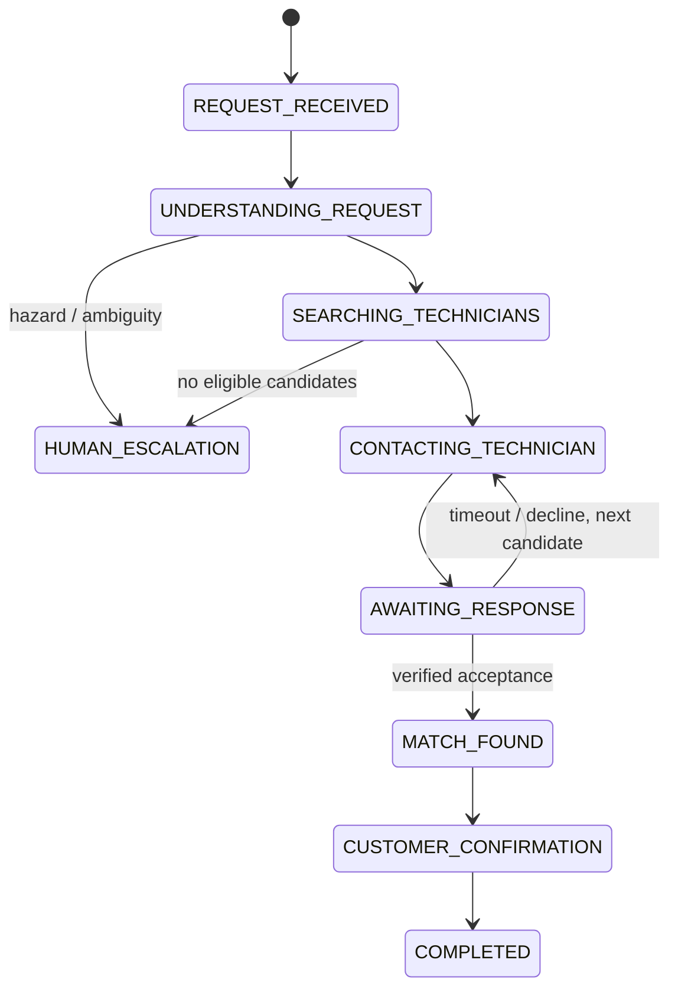

# Technical architecture

## Boundary

This repository owns only the Autopilot agent, workflow, adapters, and deployment assets created from 2026-08-17. NicheWave/RV Assist remains an external system. The dependency direction is one-way through `NicheWaveAdapter`; Autopilot never imports platform source code or reads its database.

## Responsibility split

Gemini and Google ADK interpret language, invoke the narrow deterministic safety-baseline tool, and return a schema-constrained qualification with a concise decision summary and evidence. Deterministic TypeScript re-applies safety invariants, validates eligibility, ranks by explicit inputs, enforces state transitions, performs idempotency checks, and blocks confirmed-job creation until a technician acceptance exists.

Cloud Run exposes the request API and receives authenticated Pub/Sub and Cloud Tasks pushes. Pub/Sub carries resumable external workflow events. Cloud Tasks dispatches technician-response deadlines at their scheduled time instead of using delivery failures as a timer. Firestore stores durable workflow state with optimistic version checks. `OutreachAdapter` owns technician and customer message delivery; the current synthetic implementation records deterministic delivery evidence without contacting real people. Local in-memory implementations preserve the same contracts for repeatable judge runs.

## State lifecycle

The workflow implements decline/timeout failover, verified technician acceptance, customer confirmation, and idempotent external job completion. Cloud Tasks owns durable response deadlines; stale tasks are acknowledged without reopening or mutating a completed decision.

## Safety flag taxonomy

Safety flags are classified through a single shared vocabulary in `src/tools/qualify-request.ts`, never by inspecting flag spelling. `isEscalationFlag` decides whether a human is required; `isPhysicalHazardFlag` decides whether emergency urgency is forced. Every consumer — workflow escalation, ADK invariant enforcement, and the evaluation harnesses — uses those two functions.

`isEscalationFlag` is fail-safe by construction: any flag not on the small benign allow-list requires a human, so a flag invented by a model escalates rather than being ignored.

Hazard detection is proximity-based rather than phrase-based. A subject noun near a hazard cue in either order raises the flag, so "I smell gas", "the propane line is leaking", and "the wiring near the converter had melted" are all recognised. Negation is evaluated per occurrence, so a leading "no smoke detector" cannot suppress a hazard stated later in the same sentence. Term matching is word-bounded, so `ac` does not match `jack` and `pet` does not match `carpet`. Category selection prefers the most specific matching term, so a "roof air conditioner" routes to HVAC rather than roofing.

Customer free text is untrusted input that reaches an LLM prompt. Recognised instruction-steering phrases raise `possible-prompt-injection`, which caps confidence and routes the request to a human rather than attempting to sanitise the text.

## Autonomy boundary

`general` is a routable trade, not a failure state. Requests naming an RV component or system — awnings, slide-outs, stabilizer jacks, steps, doors, windows, flooring, levelling, cameras, tanks — classify as general mobile work and proceed to a generalist technician. Only a request naming no system, component, or trade at all lacks the signal to act.

Escalation is therefore never triggered by absence of confidence alone. Every stop carries a named reason: `safety-hazard`, `suspected-injection`, `unrecognised-safety-flag`, `no-actionable-signal`, `qualification-unavailable`, `no-eligible-technicians`, `candidate-pool-exhausted`, `outreach-delivery-failed`, `customer-declined-match`, or `customer-contact-failed`. Safety stops and marketplace exhaustion are distinct causes and are never reported as one number.

The governing rules are in [the autonomy and escalation policy](autonomy-and-escalation-policy.md).

## Key invariants

1. Duplicate request IDs return the previously stored workflow.
2. Only verified, in-area, specialty-matched technicians may be candidates. NicheWave results are re-checked by the workflow engine before outreach rather than trusted, and rejected candidates are recorded as `INELIGIBLE_CANDIDATES_REJECTED`.
3. Urgent requests exclude technicians unavailable today.
4. No confirmed job can be created without a recorded technician acceptance timestamp.
5. Hazardous or low-confidence requests stop for human review before outreach.
6. Replayed callback messages return the already persisted state rather than repeating an action.
7. External job creation receives the same idempotency key as customer confirmation.
8. A response deadline is scheduled only after technician outreach reports successful delivery.
9. Every outreach attempt records a delivery ID, audience, recipient, synthetic channel, status, timestamp, and idempotency key in the workflow timeline.
10. The model may raise urgency but never lower it below the deterministic baseline, and its confidence is capped at a bounded uplift over the baseline.
11. Suspected instruction injection in customer text routes the request to a human.
12. Classification as `general` never escalates by itself; only absence of any actionable signal does.
13. Every escalation records a named, attributable reason.

## Qualification modes

The default local qualifier is deterministic so credential-free judging remains reproducible. The deployed qualifier runs the latest stable general-purpose Gemini Flash model through Google ADK and Vertex AI. The configured submission candidate is Gemini 3.6 Flash. It stores the framework, agent, requested and resolved model versions when available, tool calls, token count, latency, safe decision summary, evidence, and fallback reason alongside workflow state. Hidden model reasoning is never requested or exposed.

The ADK agent must call `calculate_safety_baseline`. Its final response must pass a Zod schema. Application code then independently recomputes and merges the deterministic safety flags, forces emergency urgency when a physical hazard is present, floors urgency at the deterministic baseline, and caps confidence at a bounded uplift — making those guards non-bypassable. Any timeout, model/API error, invalid structured response, or missing required tool call activates deterministic fallback instead of failing the workflow.
