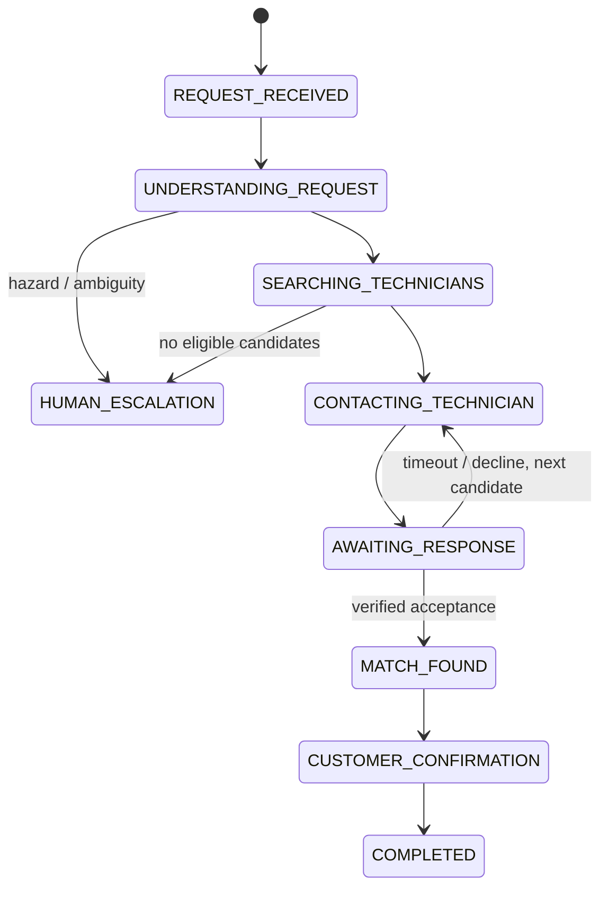

# Technical architecture

## Boundary

This repository owns only the Autopilot agent, workflow, adapters, and deployment assets created from 2026-08-17. NicheWave/RV Assist remains an external system. The dependency direction is one-way through `NicheWaveAdapter`; Autopilot never imports platform source code or reads its database.

## Responsibility split

Gemini and Google ADK interpret language, invoke the narrow deterministic safety-baseline tool, and return a schema-constrained qualification with a concise decision summary and evidence. Deterministic TypeScript re-applies safety invariants, validates eligibility, ranks by explicit inputs, enforces state transitions, performs idempotency checks, and blocks confirmed-job creation until a technician acceptance exists.

Cloud Run exposes the request API and receives authenticated Pub/Sub and Cloud Tasks pushes. Pub/Sub carries resumable external workflow events. Cloud Tasks dispatches technician-response deadlines at their scheduled time instead of using delivery failures as a timer. Firestore stores durable workflow state with optimistic version checks. `OutreachAdapter` owns technician and customer message delivery; the current synthetic implementation records deterministic delivery evidence without contacting real people. Local in-memory implementations preserve the same contracts for repeatable judge runs.

## State lifecycle

The workflow implements decline/timeout failover, verified technician acceptance, customer confirmation, and idempotent external job completion. Cloud Tasks owns durable response deadlines; stale tasks are acknowledged without reopening or mutating a completed decision.

## Key invariants

1. Duplicate request IDs return the previously stored workflow.
2. Only verified, in-area, specialty-matched technicians may be candidates.
3. Urgent requests exclude technicians unavailable today.
4. No confirmed job can be created without a recorded technician acceptance timestamp.
5. Hazardous or low-confidence requests stop for human review before outreach.
6. Replayed callback messages return the already persisted state rather than repeating an action.
7. External job creation receives the same idempotency key as customer confirmation.
8. A response deadline is scheduled only after technician outreach reports successful delivery.
9. Every outreach attempt records a delivery ID, audience, recipient, synthetic channel, status, timestamp, and idempotency key in the workflow timeline.

## Qualification modes

The default local qualifier is deterministic so credential-free judging remains reproducible. The deployed qualifier runs the latest stable general-purpose Gemini Flash model through Google ADK and Vertex AI. The configured submission candidate is Gemini 3.6 Flash. It stores the framework, agent, requested and resolved model versions when available, tool calls, token count, latency, safe decision summary, evidence, and fallback reason alongside workflow state. Hidden model reasoning is never requested or exposed.

The ADK agent must call `calculate_safety_baseline`. Its final response must pass a Zod schema. Application code then independently recomputes and merges the deterministic safety flags, making that guard non-bypassable. Any timeout, model/API error, invalid structured response, or missing required tool call activates deterministic fallback instead of failing the workflow.
